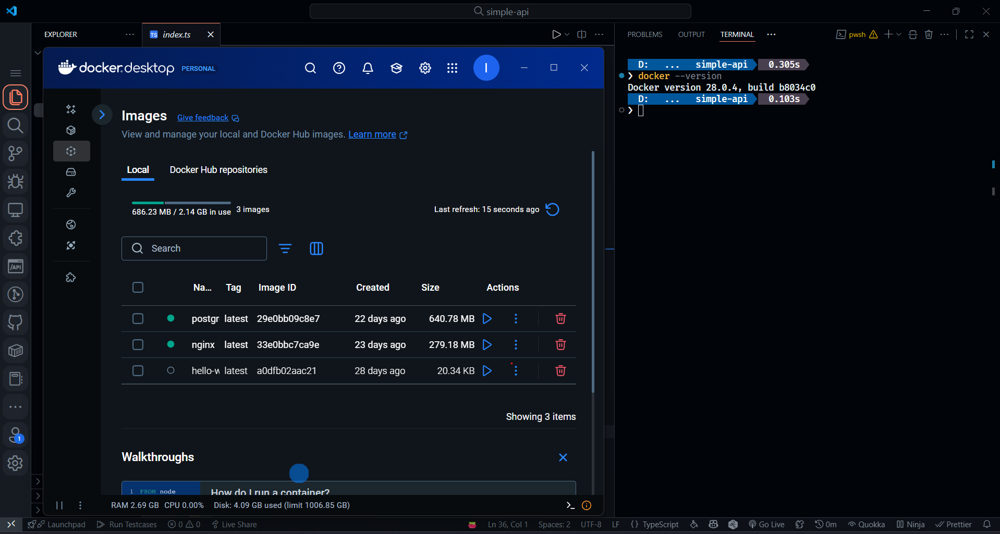

# MinIO Object Storage - Tugas Sistem Terdistribusi

## 📋 Deskripsi Proyek

Proyek ini merupakan implementasi sistem penyimpanan objek terdistribusi menggunakan MinIO sebagai bagian dari tugas mata kuliah Sistem Terdistribusi. MinIO adalah server penyimpanan objek yang kompatibel dengan Amazon S3 API, memungkinkan pengembangan aplikasi cloud-native dengan mudah.

## 🛠️ Tech Stack

- **Node.js** - Runtime JavaScript
- **MinIO** - Object Storage Server
- **Docker & Docker Compose** - Containerization
- **AWS SDK for JavaScript v3** - Client library untuk berinteraksi dengan MinIO
- **ES Modules** - JavaScript module system

### Dependencies

- `@aws-sdk/client-s3` v3.899.0 - AWS S3 SDK untuk JavaScript
- `dotenv` v17.2.3 - Environment variables loader

## 📁 Struktur Proyek

```text
minio/
├── docker-compose.yml      # Konfigurasi container MinIO
├── package.json           # Dependencies dan konfigurasi Node.js
├── README.md             # Dokumentasi proyek
├── assets/               # Folder contoh file untuk upload
│   └── install-docker.png
├── downloaded/           # Folder hasil download file
└── src/                 # Source code aplikasi
    ├── config/
    │   └── config.js     # Konfigurasi koneksi MinIO
    ├── upload_file.js    # Script upload file
    ├── download_file.js  # Script download file
    ├── list_bucket.js    # Script list buckets
    └── delete_file.js    # Script hapus file
```

## 📂 Penjelasan Folder dan File

### Folder `src/`

Berisi source code utama aplikasi dengan fungsi-fungsi CRUD untuk MinIO:

- **`config/config.js`** - Konfigurasi koneksi ke MinIO server menggunakan AWS S3 SDK
- **`upload_file.js`** - Script untuk mengupload file ke MinIO bucket
- **`download_file.js`** - Script untuk mendownload file dari MinIO bucket
- **`list_bucket.js`** - Script untuk menampilkan daftar buckets yang tersedia
- **`delete_file.js`** - Script untuk menghapus file dari MinIO bucket

### Folder `assets/`

Berisi contoh file yang dapat digunakan untuk testing upload:

- `install-docker.png` - Contoh file gambar untuk testing upload/download

### Folder `downloaded/`

Folder tujuan untuk menyimpan file yang telah didownload dari MinIO server.

## 🐳 Docker Compose Configuration

File `docker-compose.yml` berisi konfigurasi untuk menjalankan MinIO server:

```yaml
version: "3.8"

services:
  minio:
    image: minio/minio
    container_name: minio
    ports:
      - 9000:9000  # MinIO API
      - 9001:9001  # MinIO Console UI
    environment:
      MINIO_ROOT_USER: admin
      MINIO_ROOT_PASSWORD: admin123
    volumes:
      - "D:/Informatics/minio/"  # Data volume
    command: ["server", "/data", "--console-address", ":9001"]
```

### Penjelasan Konfigurasi

- **Port 9000**: MinIO API endpoint
- **Port 9001**: MinIO Console UI (Web Interface)
- **Environment Variables**: Kredensial admin (username: admin, password: admin123)
- **Volumes**: Mapping data storage ke host machine

## 🚀 Cara Instalasi dan Penggunaan

### Prerequisites

1. **Docker & Docker Compose** terinstall
2. **Node.js** (versi 18 atau lebih baru)
3. **npm** atau **yarn**

### Langkah Instalasi

#### 1. Install Docker (jika belum terinstall)



- Download dan install Docker Desktop dari [docker.com](https://docker.com)
- Pastikan Docker daemon running

#### 2. Install Dependencies

```bash
npm install
```

#### 3. Jalankan MinIO Server

```bash
docker-compose up -d
```

#### 4. Akses MinIO Console

- Buka browser dan kunjungi: `http://localhost:9001`
- Login dengan:
  - Username: `admin`
  - Password: `admin123`

#### 5. Buat Bucket (melalui Console UI)

1. Login ke MinIO Console
2. Klik "Create Bucket"
3. Nama bucket: `tes` (sesuai dengan script)
4. Klik "Create Bucket"

### Menjalankan Script

#### Upload File

```bash
cd src
node upload_file.js
```

#### Download File

```bash
cd src
node download_file.js
```

#### List Buckets

```bash
cd src
node list_bucket.js
```

#### Delete File

```bash
cd src
node delete_file.js
```

## ⚙️ Konfigurasi Environment

Aplikasi mendukung konfigurasi melalui environment variables:

```bash
# .env (optional)
MINIO_ENDPOINT=http://localhost:9000
MINIO_ACCESS_KEY=admin
MINIO_SECRET_KEY=admin123
MINIO_REGION=us-east-1
```

## 🔗 Endpoint MinIO

- **API Endpoint**: `http://localhost:9000`
- **Console UI**: `http://localhost:9001`

## 📝 Catatan Pengembangan

1. Pastikan Docker daemon berjalan sebelum menjalankan `docker-compose up`
2. Bucket harus dibuat terlebih dahulu sebelum menjalankan script upload
3. File path dalam script menggunakan relative path, sesuaikan jika diperlukan
4. Volume mapping di `docker-compose.yml` perlu disesuaikan dengan path sistem Anda
